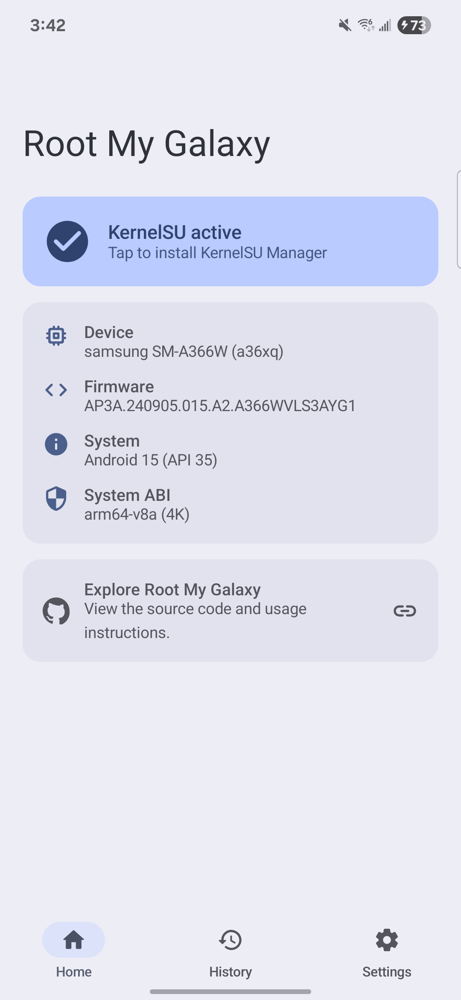
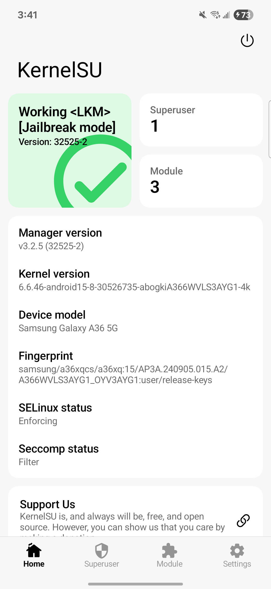

# SM-A366W A366WVLS3AYG1 validation

This profile was validated on a Canadian Galaxy A36 5G running the exact
firmware and kernel below.

| Field | Value |
| --- | --- |
| Model | `SM-A366W` |
| Device | `a36xq` |
| Firmware | `A366WVLS3AYG1` |
| Android | 15 / API 35 |
| Page size | 4096 |
| Kernel | `6.6.46-android15-8-30526735-abogkiA366WVLS3AYG1-4k` |

The app payload completed bootstrap root, and the exact-build KernelSU module
was late-loaded successfully. KernelSU Manager reported
`Working <LKM> [Jailbreak mode]`, version `32525-2`, with SELinux Enforcing.
Root My Galaxy reported `KernelSU active` on the same boot.

## Device evidence

| Root My Galaxy | KernelSU Manager |
| --- | --- |
|  |  |

Shell verification:

```text
$ su -c id
uid=0(root) gid=0(root) groups=0(root) context=u:r:ksu:s0

$ cat /proc/modules | grep kernelsu
kernelsu 172032 1 - Live ... (OE)
```

## Published artifacts

| Artifact | Bytes | SHA-256 |
| --- | ---: | --- |
| `artifacts/a36xq-A366WVLS3AYG1/cve-2026-43499-app.so` | 128688 | `481e3425d5038b7b51820d626783d5b1afb50c3358075582f14c94e5d7b52eec` |
| `kernelsu/android15-6.6_kernelsu-A366WVLS3AYG1-kdp.ko` | 325760 | `af8867bf794ac884244a652d088a9023441561cf73d4526c3f946e378e2de09c` |
| `kernelsu/ksud-A366WVLS3AYG1-kdp` | 4889120 | `2288f5f061f9dc9b27f6a3409ab68592c2050f78306dad09348f2363d5380b42` |

The module has exact vermagic:

```text
6.6.46-android15-8-30526735-abogkiA366WVLS3AYG1-4k SMP preempt mod_unload modversions aarch64
```

Audit against the recovered exact-build `vmlinux` resolved all 214 undefined
imports, with zero missing symbols and zero CRC mismatches.

The result is a volatile LKM installation. A reboot removes KernelSU and the
bootstrap/late-load process must be run again. No boot image was flashed.

This profile is exact-build support; it does not claim compatibility with
other Galaxy A36 models, firmware, or kernel releases.
